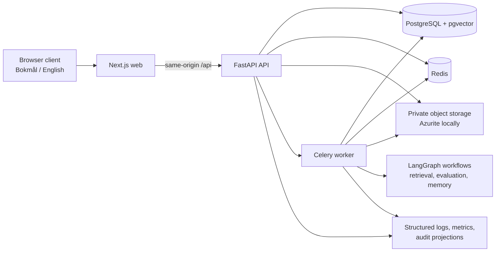

# Architecture summary

The platform is designed as an auditable enterprise workflow system: browser clients never own
sessions, authorization decisions, prompts, provider configuration, or raw private documents.
Server-side services enforce those boundaries and persist safe, reviewable projections.

## Component responsibilities

| Component                | Responsibility                                                                                                                   |
| ------------------------ | -------------------------------------------------------------------------------------------------------------------------------- |
| Next.js web              | Norwegian Bokmål-first UI with optional English, accessible navigation, and a server-side API proxy.                             |
| FastAPI API              | Authentication, RBAC, organization isolation, typed API contracts, case/document operations, and safe read models.               |
| Worker and workflows     | Asynchronous parsing, indexing, LangGraph execution, approval state transitions, and deterministic evaluation runs.              |
| PostgreSQL and pgvector  | System-of-record data, tenant-scoped workflow/audit state, evaluations, controlled memory, and vector search.                    |
| Redis and object storage | Opaque session/rate-limit state and private raw document bytes; neither is exposed directly to browsers.                         |
| Observability and CI     | Content-minimized logs, metrics, audit events, deterministic regression checks, security scanning, and local release validation. |

## Trusted workflow path

1. A signed-in user works only through the same-origin web interface; the browser receives no token
   or storage credential.
2. The API reloads the user and organization context, enforces role and tenant policy, and
   dispatches only bounded work identifiers to the worker.
3. The worker reloads authoritative state, processes private documents, and writes typed workflow
   and audit projections. Retrieval and drafting require approved, governed evidence.
4. High-risk outcomes require a separate human approval action. AI drafts and human final text
   remain distinct, and audit records describe decisions without disclosing secrets, prompts, or raw
   content.
5. Evaluation and observability provide bounded operational evidence; deterministic providers are a
   local/CI regression mechanism, not a substitute for real-model quality assessment.

## Deployment boundary

The repository validates local production images, migration behavior, health checks, clean data, and
configuration contracts. Azure is the selected future target, with Container Apps preferred before
AKS. No Azure resources, registry images, public domains, or deployed environment exist in this
version. See [deployment readiness and data modes](deployment-readiness.md) for the exact current
status and [ADR 0004](adr/0004-azure-deployment-target.md) for the decision.

## Further reading

- [Canonical architecture](../specs/architecture.md)
- [Product requirements](../specs/PRD.md)
- [Architecture decision records](adr/README.md)
- [Security guide](security.md)
- [Deployment readiness](deployment-readiness.md)
